```{r setup, include=FALSE}
knitr::opts_chunk$set(echo = FALSE)
```

# 1.0 Introduction
The data visualisation below is created by using data under the sub-section of *[Merchandise Trade by Region/Market](https://www.singstat.gov.sg/find-data/search-by-theme/trade-and-investment/merchandise-trade/latest-data)* from the Department of Statistics, Singapore.

<center>

{ width=100% }

</center>


# 2.0 Visualisation Critique

## 2.1 Clarity
1.   **Generic Title with NO Lead In**. The title do not convey the intent or message behind the visualisation as it us just a generic title indicating the merchandise trade of the top 6 trading countries for Singapore from 2019 to 2020. There is no lead in to explain ] and the reader do not know how the top 6 has been determined. i.e. total trade value from 2019 to 2020 or ..? It is unclear whether it is to provide information on intra and/or inter comparison of trade balance or total trade  values over the study period among the countries. Perhaps it could also be used to convey COVID impact on trade transaction among the top 6 trading countries by comparing pre-COVID (2019) to COVID period (2020).

2. **Unsynchronised Y Axis**. An unsynchronised Y axis scale for import / export values across all the charts increases the cognitive load in processing the comparison. By quick view, it is unclear on the ranking order of the top 6 trading countries. It was also difficult to discern the trade balance across the study period for the respective country to Singapore. E.g.  Hong Kong export values seemed to be higher than its import for selected 2019 period. However, the truth is that Singapore always has trade surplus with Hong Kong. Thus, misleading perspective is caused by different Y axis scale. 

3. **Inconsistent X Axis**.  The lack of minor markings or grid lines for the X axis have increased the difficulties in determining the exact import/export values over time.  e.g. import values for Oct 2020. It is observe that the country chart has varying width even though (less Japan) with same study period. Additional confusion is created where Japan has a shorter period compared to the rest. Its made one wonder whether there are no values during the missing period, so what are the start and end periods. Eventually, how to compare with different time period. 

4. **Area or Bar Chart**. From the chart, it is difficult to determine the exact import and export values at specific time period.  The X axis lacked the minor marking either by quarterly or monthly. As marking on yearly basis only would pose difficulties to correlate the values across both axes. Moreover, such marking would help to ease the correlation of observed trending over specific events occurred in that time period. Even though time is a continuous variable, given the data points is collated monthly rather than daily, the suitability of an area chart is put in question. i.e would a bar chart at monthly interval be better.  Nonetheless, this could be debatable. 

## 2.2 Aesthetic
1. **Attention to Details**. The font size for country is larger than the title. Moreover, the title alignment seemed to be skewed towards the right due to space extended by the legend. Font size for axis naming and values are relative the same. There is a lack of font typography and hierarchical design. All these made the chart aesthetically non-attractive.

2. **White Space**. Personally, there could be too many white spaces among the country charts and the chart sizes are inconsistent. This could be due to the need to repeat Y axis naming for the respective chart and how the 6 charts are combined.  More space shall be allocated to the chart where an enlarge chart could provide better clarity and quality on the details within. 

3. **Colour of Choice**.  Technically, one could not really fault the choice of colour for import and export respectively. Presuming the intention of the chart is to determine the trade difference overtime, then colour choice like pink and blue might be better option. Pink could represent the negative connotation. E.g. Pink for import. When one saw pink colour over the area chart, it would connote import was greater than export, something that the designer would like to give a negative connotation. 


# 3.0 Alternate Visualisation

The proposed alternative design is as follow:

<center>

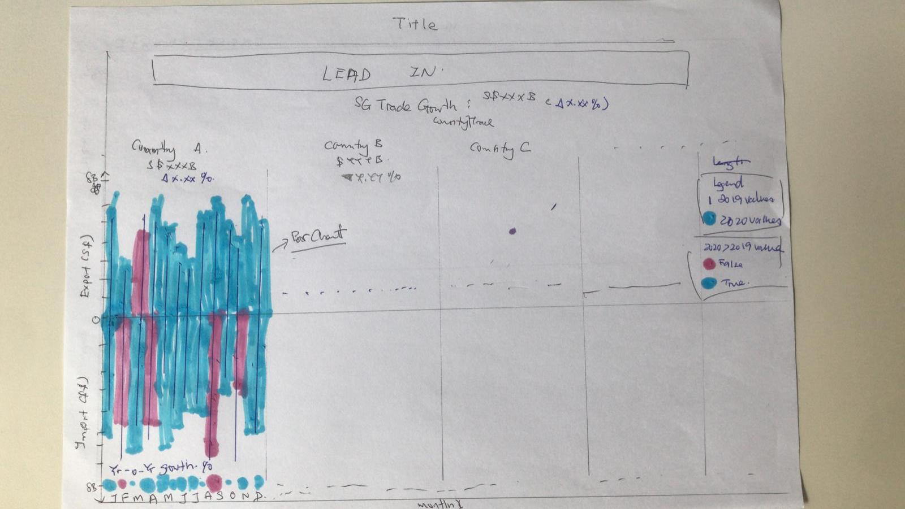{ width=100% }
</center>

## 3.1 Assumption
The intention is to provide marco view in the total trade transaction values and growth for Singapore and its top 6 trading countries in 2020 based line against 2019 for Year-over-Year (Y-o-Y) comparison. It shall also ease the understanding on growth at the export and import values for each country. Trend lines over 2020 might also be derived. Nonetheless. the visualisaiton will not focus on insights on trade balance with individual countries so not to make it too clutter.

## 3.2 Clarity & Aesthetic
Meaningful title and lead in will be used.  A rotated 90 pyramid chart based on monthly import and export values as variables on the synchronised Y axes will form the base chart. To create symmetrical along X axis, the Y axis will have symmetry end point. Given it is an rotated pyramid chart, Export will be position above the X axis where Import will be below. Rationale is than more export will create trade surplus and vice verse. The main chart will show 2020 trade values (i.e. Bar) where the 2019 values will be overlaid by using a smaller bar. (i.e vertical link) Inking will be done to ease cognitive load in identify "Export" and "Import" areas. The top 6 will also be arranged in a descending order to study the impact across them. Total trade values and growth parameters will also be inked on the chart. Suitable colour contrast, symbol and its size will be used to ease the cognitive load in processing 2019 vs 2020 trade values, negative and positive growth / impact.

### 3.2.1 Concerns

1. **Association with Export and Import Location**. It has been a long deliberation whether it should be rotated, traditional pyramid chart with time line in the Y axis  or stack bar or area chart. The concern on using pyramid chart has been that viewer might quickly associated it with a population chart and it cognitive difficult to read. Concern on rotated pyramid chart will be why import is a negative value which could be counter intuitive. The negative about pyramid chart is that one cannot have a quick overview on the total trade value at respective month as compared to stack chart. Eventually, decided on rotated pyramid chart. Could use different colours for bar chart to connote Import vs Export but worried it could be too colourful.  Eventually, other than axis naming, explain in lead in etc, inking of "Export" and "Import" words in the chart is also adopted.  

2. **Confused over 2019 vs 2020 Values**. There are too many parameters to play in this visualisation. The main variable shall be 2020 but 2019 is important to determine Y-o-Y growth rate and impact. Hopefully, different symbol, colour contrast and legend should ease the association. 

3. **Information Overload**. To avoid this, attempt to design in 4 layers across the chart. 
   + __First Layer__. It is the title with lead in to explain the visualisation intent. 
   + __Second Layer__. Marco total trade value  and Y-o-Y growth for Singapore and the top 6 countries. (On hindsight, should add the percentage of country trade values to total Singapore trade)
   + __Third Layer__. 2020 Import and Export values for each country overlaywith 2019 values. Intention is to show macro view on impact to growth rate for respective value. 
   + __Fourth Layer__. Y-o-Y growth for total trade values at monthly level for each country. Understand broad trend line on growth rate over the month in 2020 for each country.


# 4.0 Visualisation Design
The final visualisation design can be found on [here](https://public.tableau.com/app/profile/tantiger/viz/DataVizM1/Dashboard1) in Tableau Public.


# 5.0 Step-by-Step Guide 

No|Step           |Action 
--|-------------- |--------
1| Use excel to remove all unnecessary data points and information associated with the tables for respective worksheet. Only variables associated with the top 6 countries plus "Total Merchandised..." from Jan 19 to Dec 20 shall be retained. |
2| Load the excel file into Tableau Prep Builder. Drag the "Export" worksheet on the left into the canvas. Click the "+" icon for Export and select "Pivot" | 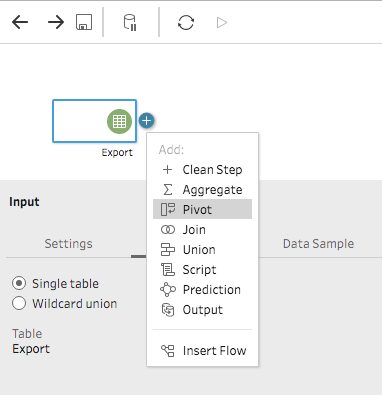{width=160% }
3| Select all the date range field. Drag and drop at the "Pivoted Fields" box.| 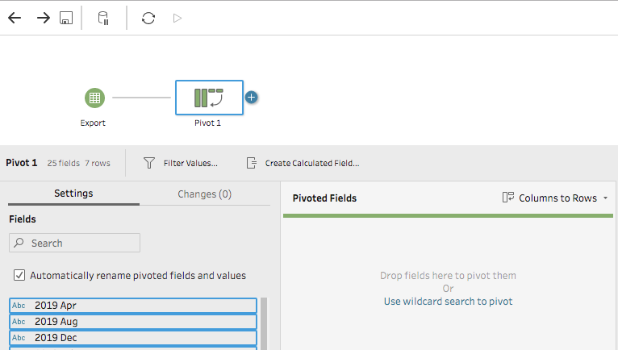{width=160%}
4| This is what one will see under "Pivot Results". One could click on the field to verify the pivot.  |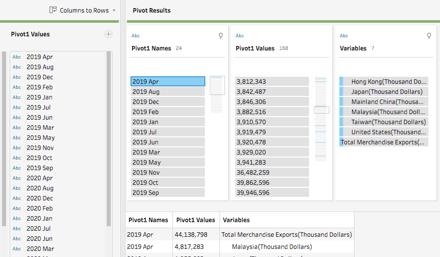{width=160%}
5| Double click into  "Total Merchandised Export..." within the "Variables" column under "Pivot Results" field.  Delete the word "Export".|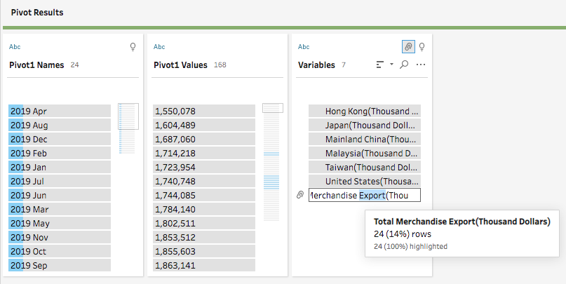{width=160%}
6| Rename the columns.i.e "Variables" to "Country", "Pivot Names" to "Date", "Pivot Values" to "Export Values".  Repeat Step 2 to 6 for "Import" worksheet. Ensure the field "Total Merchandised.." has the same spelling in both sheets|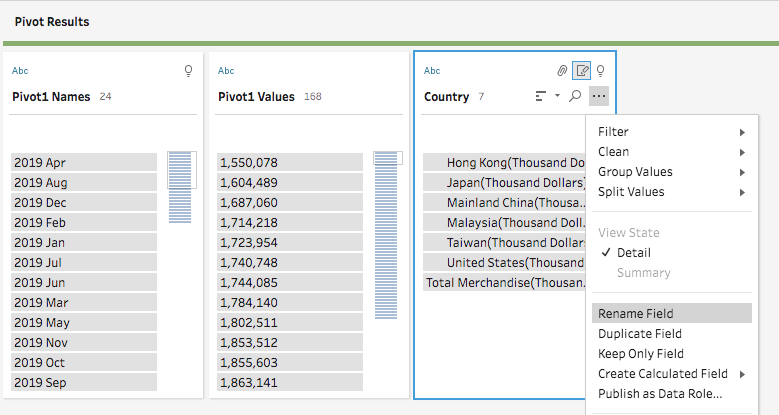{width=160%}
7| Drag either "Pivot" box in the canvas to the other box. A "Join" symbol will appear. Drop the box within. Set the parameters for join under the "Applied Join Clause".  One can check under "Summary of Join Results" to see mismatched values that will display as red colour. The join will be simple unless one made mistake in Step 5, else remove the duplicated columns. |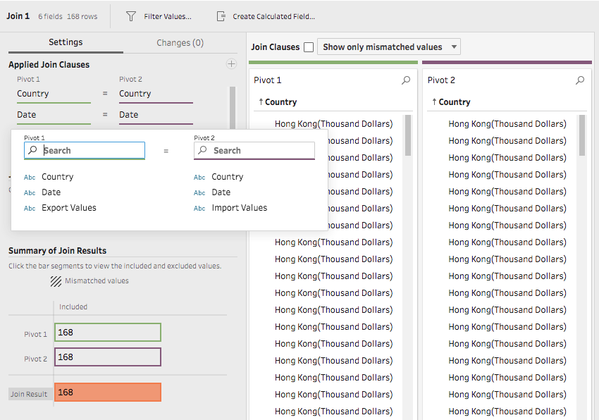{width=160%}
8|Click the "+" icon from the "Join" box in the canvas and select "cleaning".|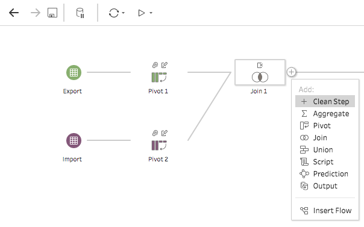{width=160%}
9|Select "Split Values" and "Automatic Split" from the "Country" Column to extract the country name from the variable. Remove duplicated columns. |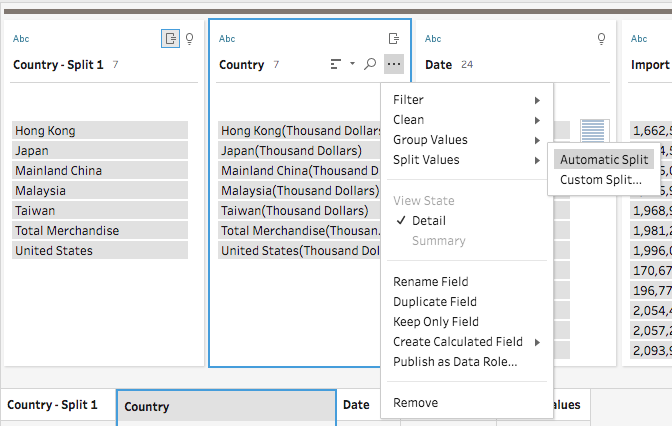{width=160%}
10|Change the data type for the respective column. |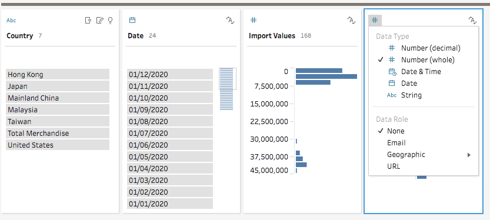{width=160%}
11|Click the "+" icon from the "Clean" box in the canvas and select "Output". Set the parameters for saving the new data set. |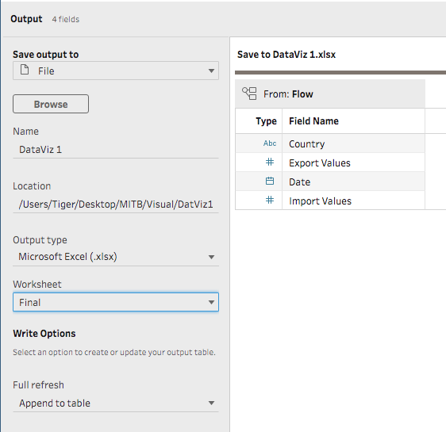{width=160%}
12|Load the saved excel into Tableau Desktop and drag the saved sheet into the canvas. Create calculated new field from Import and Export Variables to determine the new variables of Import and Export for year 2019 and 2020 respective. eg "Import 2019". Multiplied by 1000 to account for the normalised value of "thousand" (removed in Step 9) Step 3 could also be used to instead of this step by pivoting the variable by year.|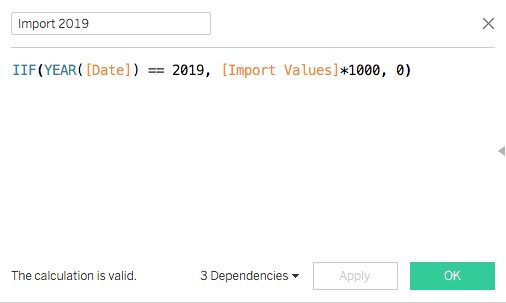{width=160%}  
13|Create calculated new field to determine the monthly "Total Trade" by summing the Import and Export variables.  |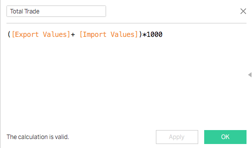{width=160%}
14|Drag the variables "Country" and "Date" into the Columns as Dimension. Filter "Total Merchandised" from the  "Country" dimension. Then change the "YEAR(DATE)" into "MONTH(Date)" to have a monthly x axis wrapped by the Country. Drag the variables "Export 2019", "Export 2020", "Import 2019" and "Import 2020" into the Rows as Measures. 4 x Bar Charts for the respective rows variables will be created. Note where the Export Charts are positioned.|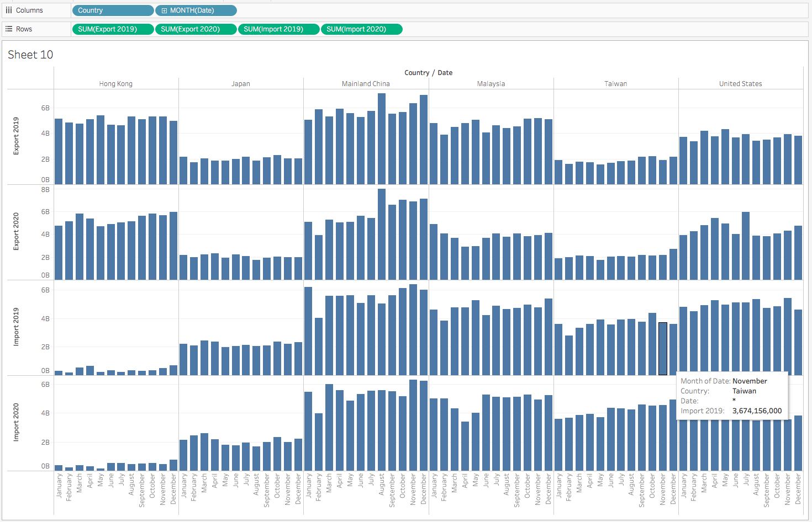{width=160%}
15|Select "Dual Axis" from the drop down of "SUM(Export 2020)". This would merge both Export charts. Right click on the Export Y axis and select "Synchronise Axis" to make "Export 2019" and "Export 2020" have similar Y axis scale. Repeat the steps for the Import Measures. |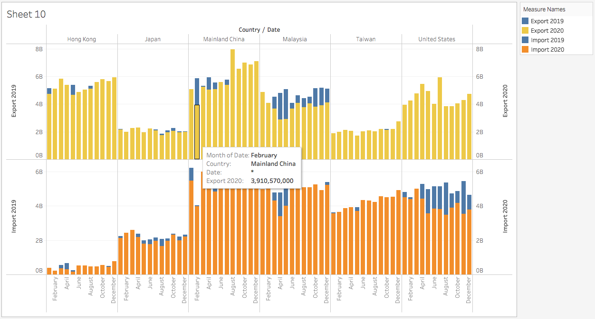{width=160%}
16|Sort the "Country" based on total trade value in a descending order by clicking the "Country" dimension and select the "Sort..." in the drop down, select the parameters based on the displayed image. This is to allow quick visual on the rank order for top 6. It is verified that the similar descending order regardless of period i.e. (2019+2020) or (2020) |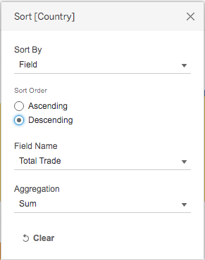{width=100%}
17|At the Marks shelf, set the same bar size (to become a vertical line) and colour for the "Sum(Import 2019)" and "Sum(Export 2019)" variables. For 2020 variables, lower the colour opacity or could use different colour to represent import and export bar chart respectively. |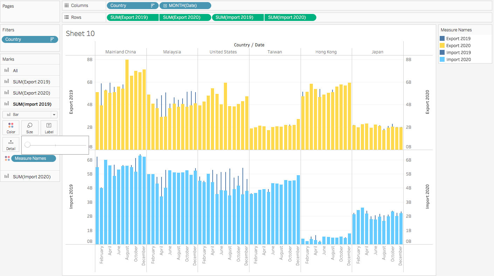{width=160%}
18|To improve clarity for the 2019 values, right click on the any 2019 X axis and select "Move marks to front". | 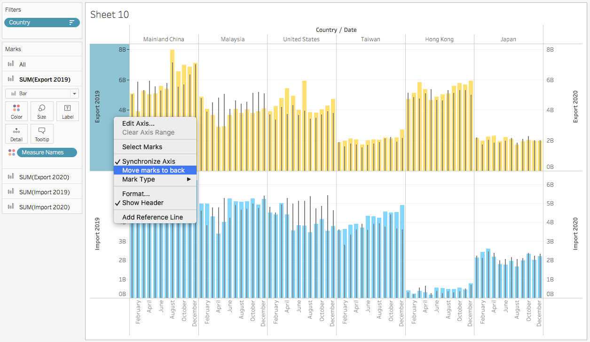{width=160%}
19|For both Y axes, change the range to Fixed and set the end value to "8,100,000,000". Amend the Axis Title. Set Scale to "Reversed" ONLY for Import Y axis. Intention is to create a symmetrical scale along the x axis to ease comparison.|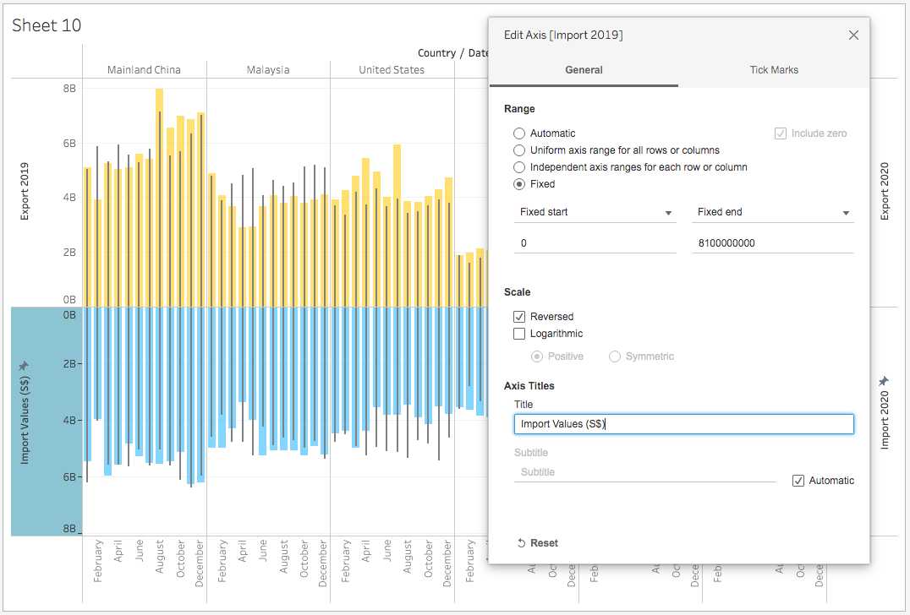{width=160%}
20|Drag the variables "Export 2020" into "Export 2020" Marks shelf. Double click into the measure and type "> SUM([Export 2019])". It will change into a logic Dimension. Assign colour to it. |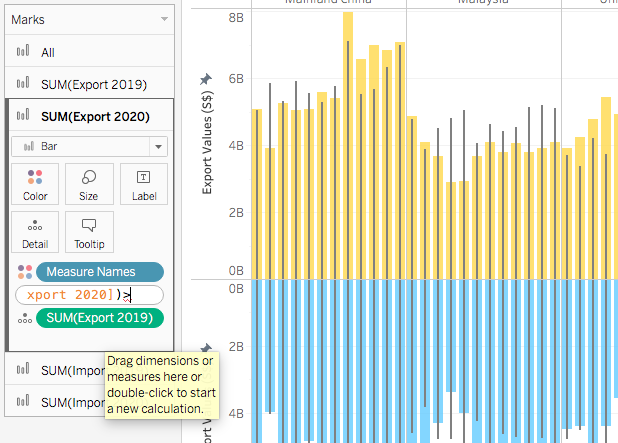{width=160%}
21|For chart, one can observe that when "Export 2020" is less than "Export 2019" (i.e.negative Yr-to-Yr import values), the bar chart will change to pink colour. This is to ease the visualisation on impact. Repeat for "Import 2020".|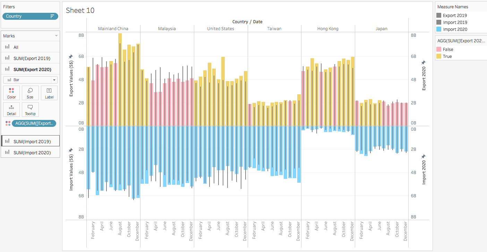{width=160%}
22|Remove unnecessary headers, format the remainder headers, adjust font size, colour, grid lines inking and change the format of "Month(Date)" into "First Letter".|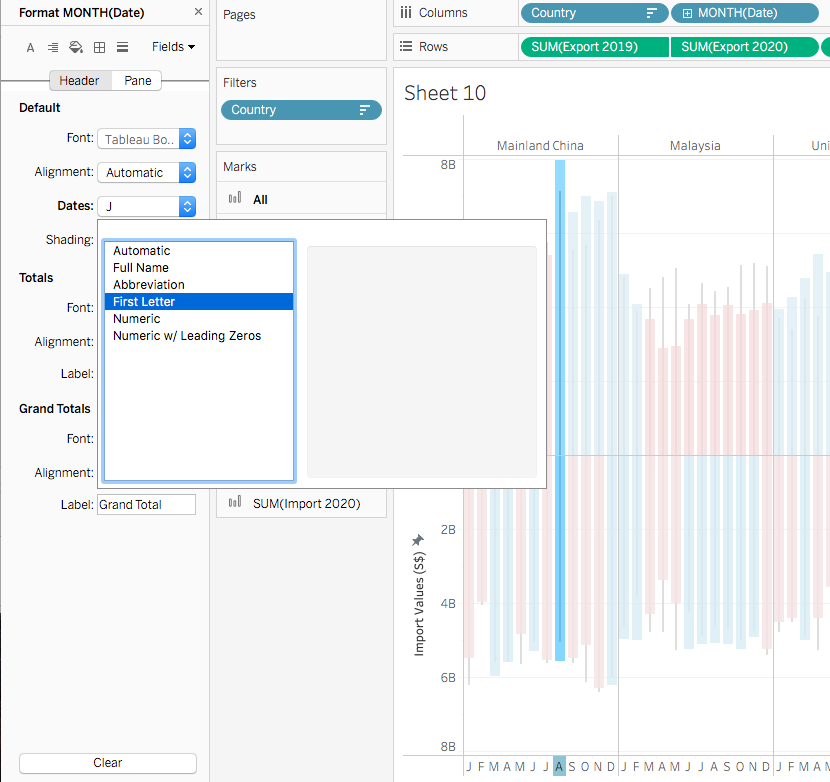{width=160%}
23|Right click on the top chart and select "Annotate -> Area" to add "Export" into the chart. Adjust the colour tone and repeat for the Import Chart. Purpose is to do the enhanced the inking on which bar chart represent export or import. |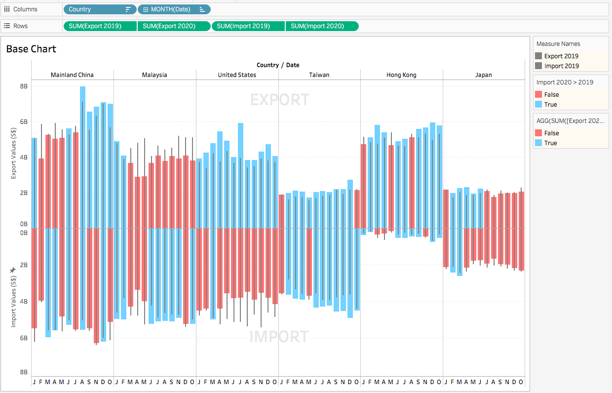{width=160%} 
24|Download the country flag icon from the internet and save it in the directory:("My Tableau Repository\Shapes\Flags"). (Need to create flag folder) Drag the "Country" into Columns shelf in a new sheet. At Marks shelf, change the chart into "Shape" and drag "Country" into "Shapes". Click on the "Shapes" and assigned the respective flag icon to the variable. Repeat for SG flag by using "Total Merchandised" (The visualisation has been designed using resources (country images) from [Flaticon.com](https://www.flaticon.com/) by [Freepik]("https://www.freepik.com")|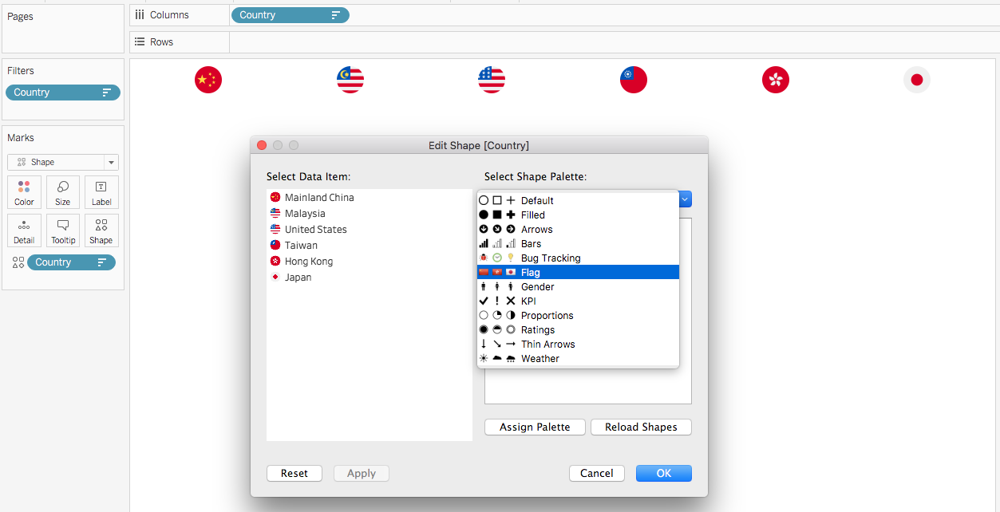{width=160%}
25|Create the calculated field for "Total Trade 2019" based on the image. Repeated for "Total Trade 2020".| 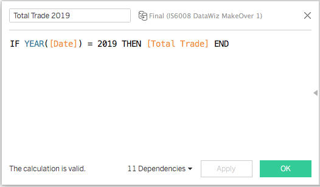{width=160%}
26|Create the calculated field for "Annual Growth" a logic measure to determine whether Trade Value in 2020 is more than Trade Value in 2019. Then calculated field for "Annual Growth%" reference to the image. The purpose is to compute annual Y-o-Y growth for each country.|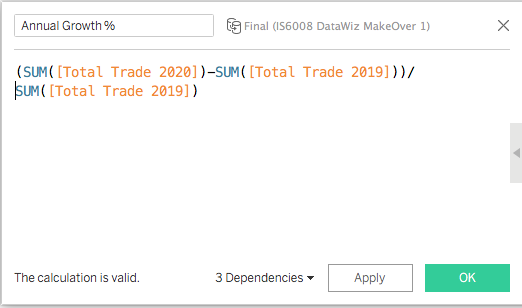{width=160%}
27|On a new sheet, drag "Country" and "Total Trade 2020" to Rows shelf. Convert the former to a Dimension with discrete value rather than keep it as Measure. Filter "Country" to only "Total Merchandised" and "Edit Aliases ..." to "SG 2020 Total Trade Value:". Drag "Annual Growth" and "Annual Growth%" into Marks Shelf Colour and Text respectively. The former will create the logic and thus visual contrast to determine whether positive or negative growth. The latter is to compute the growth value. Format the growth value by using custom for number. We will be using icon to represent positive and negative to ease visualisation. |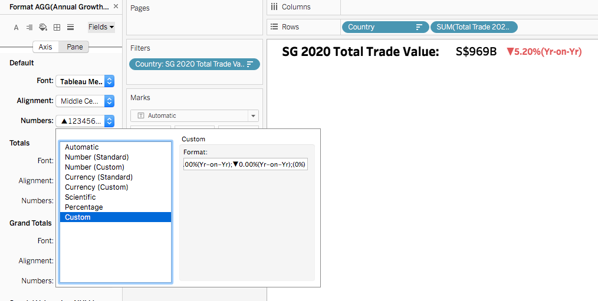{width=160%}
28|Repeat step 27 but with "SG 2020 Total Trade Value:" filter off from "Country". Drag the variables into Column rather than Row Shelf. |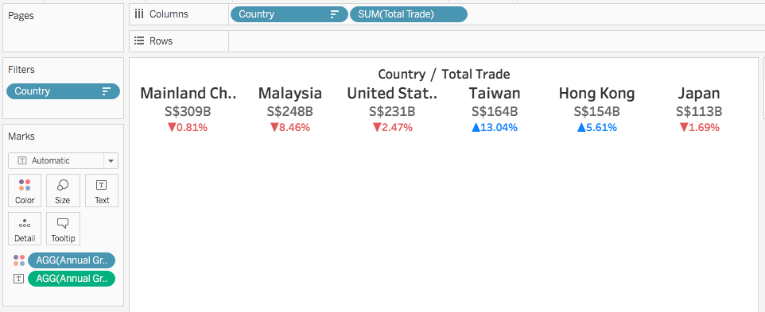{width=160%}
29|Create a Y-o-Y Growth for total trade values on each month in 2020. On the new sheet, drag "Country" and "Date" into Columns Shelf with the required filter and setting to month. drag "Annual Growth%" into Marks Shelf Colour and Size respectively as Measure. This is to create the visual cue for negative / positive values with size to indicate the difference magnitude.|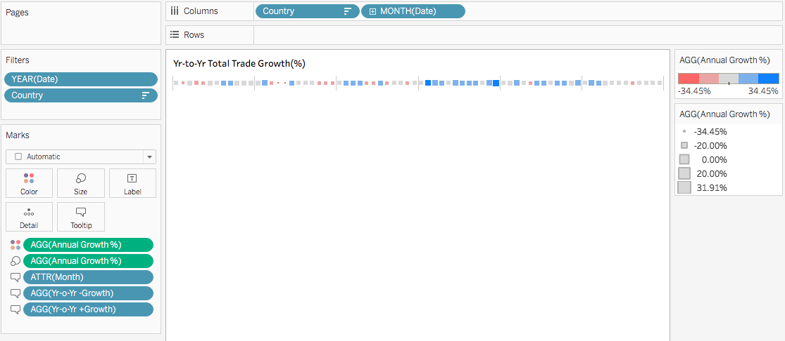{width=160%}
30.| Combine all the sheets into a dashboard and realign the sheets to achieve the required aesthetics outcome. Add Title, Lead In, Source and Legend to enhance comprehension on the visualisation intent.|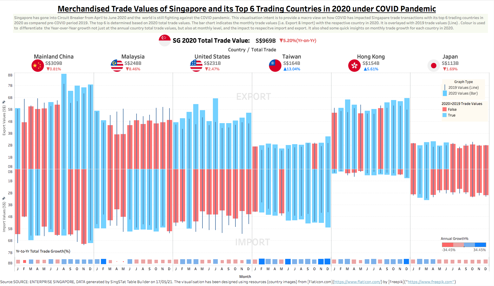{width=160%}


# 6.0 Derived Insights

<center>
{ width=100% }
</center>

The derived insights are:

1. **Mostly Negative in Growth**. The Y-o-Y growth for the total trade values for SG is negative (i.e-5.20%) followed by it main trading partners in descending order Malaysia (-8.46%), USA (-2.47%), Japan(-1.69%) and China (-0.81%). Nonetheless it is surprising that SG has strong positive growth with Taiwan (+13.04%) and Hong Kong (+5.61%). Moreover, the negative growth in China is deemed to be low given the country has been seriously hit with COVID in early 2020.

2. **Uneven Impact to Monthly Import and Export Values for the Top 6 Countries**. 

    + __Front End Negative Impact__. China trade is affected generally a bit more on export from Singapore than import during the first 6 mths of 2020. Thereafter, negative import growth for some of the remaining months but the last 6mths has seen relatively strong trade growth due to higher export from Singapore.

    + __Sharp Point Negative Impact__. The trade between Singapore and Malaysia have been badly hit during Mar to May 2020. This has been the period where both implemented country lock down such that direct land trade via Johor has been affected. As Malaysia has been implementing a series lock down even after that, one can observe its continue impact to export from Singapore. Overall trade growth has been negative in the last 6 mths of 2020.

    +  __Lop-Sided Impact__. Generally, Y-o-Y import growth for Singapore to USA in 2020 has generally been negative, while positive for export. Nonetheless, the overall trade growth has been negative due to higher negative growth in import which offset positive growth in export. It is interesting to find out the low import from USA.
  
    + __Limited Impact__. Interesting, both Taiwan and Hong Kong have mainly experienced positive growth with Singapore. In 2020, both countries have generally been known to have relative small number of COVID cases.
  
    + __Tail End Negative Impact__. Generally, the fluctuation in trade values for Japan has been less drastic. Nonetheless, both import and export values experience negative growth in the last 6 mths of 2020. Somehow it might be correlated to the progressive increase in the number of COVID cases in later part of the year. 

3. **Trending for Trade Growth in 2020 base on Monthly Trade Values**. From the "Y-o-Y Growth" chart at the bottom of the visualisation, one can use colour and size of the square to have a macro view on the total trade trending between Singapore and each country. Both Taiwan and Hong Kong have seemed to be on a growing trend based on the darker blue and bigger square. China is also progressively growing after the initial dip. Japan trade growth has been dropping steadily. Similar to Malaysia less the high negative growth during Singapore Circuit Breaker. USA has been a roller coaster ride but generally more negative than positive. Somehow, one could correlate the trending to how the country has been  doing on controlling the spread of COVID within. From the growth chart,  the outliers growth has given a wider range of values in the colour tagging to the values which might dilute the details within. These outliers could have deeper impact to Singapore overall trade values. It will be interesting to see how the trending will carry on into 2021 where pandemic has generally been controlled in most but no all, as some been hit with second or third waves of COVID attack.eg Taiwan.   


# 7.0 Conclusion

The visualisation has provided a macro view of total merchandised trade values for SG and its top 6 trading partner. A quick insights on the Y-o-Y growth on annual trade values, import and export values for each trading country with SG under the pandemic COVID 19. It also shed marco insight on monthly growth in 2020 showing signs of recovery for selected countries. Nonetheless, the future is still uncertain in this pandemic era as country worry about subsequent COVID attack. Effectively, trade economics can be affected by numerous factors other than COIVD. Thus without deep research and confirmatory analysis,one cannot confidently conclude the negative growth can be fully attributed to the pandemic while selected incidents could.


# 8.0 Recommendation

Future exploration to enhance understanding on trade growth can focus on 2 areas as follows:

1. **Micro View on Merchandised Trade**. To research on which types of goods and services have resulted in the negative or positive growth with respective country import and export values. With the deeper understanding in quantitative approach, the ability to correlate the insights and discern whether the impact on growth could be attributable to COVID or other international policy or economics dynamics.

2. **Causation to Growth in Merchandised Trade**. COVID 19 can be a causation to the growth insights discerned from the visualisation at the macro level. However, other political or economical factors can impact how good and services flow globally. eg Trade wars between US and China, sequential lock down in Malaysia,  Taiwan growing foot print in electronic supply chain etc  Need to have deeper research into the qualitative area to understand the impact to Singapore Trade. 

