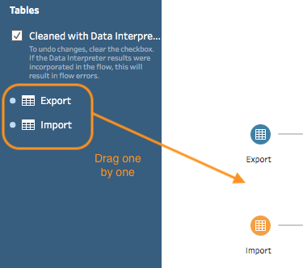
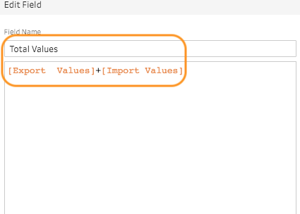
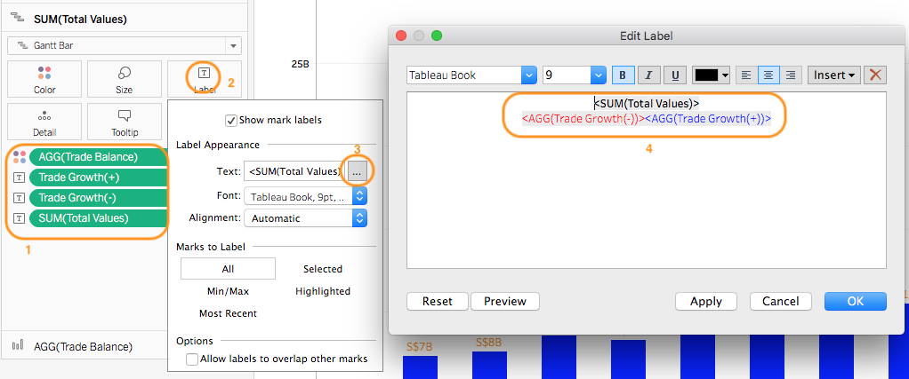

```{r setup, include=FALSE}
knitr::opts_chunk$set(echo = FALSE)
```

# 1.0 Introduction
The data visualisation below is taken from the [Department of Statistics Singapore](https://www.singstat.gov.sg/modules/infographics/singapore-international-trade). It is "mini"-interactive visualisation showing the major trading partner where it is part of an infographics on Singapore International Trade. Intention is to communicate about Singapore merchandise trade performance with major trading partners in 2020. Our task here is to explore means to enhance the visualisation effects through a makeover exercise. The data used in our work is from the sub-section of *[Merchandise Trade by Region/Market](https://www.singstat.gov.sg/find-data/search-by-theme/trade-and-investment/merchandise-trade/latest-data)* of the Department of Statistics, Singapore. 

<center>

{ width=50% }

</center>

# 2.0 Visualisation Critique

## 2.1 Clarity. 

Assuming the intention was to communicate Singapore trade balance with the major trading partners but generally there was a difficulty in discerning the countries association with trade balance in particular for those overlapping at the boundary between net exporter and importers. The critiques were: 

1. **Difficulty in Discerning Net Importer or  Exporter for Country Closed to Boundary**. Difficult to associate countries closed to the boundary (i.e. Japan, EU, Malaysia, Korean and United States) as net exporters or importers as the icons overlapped in the diagram and undermined it positional reference to the boundary. On the web interactive mode, it was still difficult to discern for some of the countries due to high opacity colour that do not ease the interpretation with the boundary line. Eventually, one cannot confidently determined the trade balance information for countries like Japan, EU and Korea even in the web version. 

2. **Position of Axes Header and Values**. In quick view, the X axis was deemed to be the "Import" parameter as header at the bottom of the graph was normally associated with the X axis. Given the familiarity with the data, it was identified that the header for X axis was "Export". Axes header positioning couple with similar colour adoption to the values could improve clarity. Moreover, the header should also include the axis unit symbol. i.e. billion or million

3. **Visualisation Title**. No title in the display graph (noted there was title on the web version) to provide an overview on what the visualisation intent . Nonetheless, the intent could be discerned from the explanation below.

4. **Explanation in the Last Lead In with "!"**. Two sentences in the information box where one remained true in the visualisation while the 2nd on United States do not seem to be truth. If was contradicting for United States given it has higher export as displayed in the visualisation. Its confusing whether United States export has exceeded import only in current context or much earlier. The explanation could be improved to provide better clarity. 

## 2.2 Aesthetic

Generally, it was pleasant and good use of label with similar colour as the bubble. However, it also provided a messy and complicated visual at the areas where the countries overlapped at the boundary. Better treatment could be done to improve aesthetic, such as:

1. **Bubble Sizing**. The sizing of the bubble for those with larger trade volume might be overwhelming big. Better treatment could be done on the sizing to improve overall aesthetic especially in the overlapping region.

2. **Colour Contrast and Opacity**. Better colour contrast and lower opacity to enhance the visual "readability" especially for those overlapping countries like EU and United States. Quick visual look tends to associate United States label with EU. 

3. **Label Positioning**.  Label positioning could be improved to reduce the messy view by positioning closer to the bubble icons. eg United States, EU and Malaysia  Labels, they could be swapped in the order and with adjustment to enhance readability and association.

4. **Enhanced Visual Cue**. Many good visual cues have been build in. However, the centre point of the bubble do not really aid the interpretation on whether it was net exporter or importer. One option was to has visual indicator either by colour or text on the bubbles or label to explicitly indicate the type.

# 3.0 Alternate Visualisation

The proposed alternative design is as follow:

<center>

{ width=100% }
</center>

## 3.1 Assumption
The intention is to provide marco view in the trade merchandised for the top 10 major trade partners of Singapore from 2011 to 2020. The focus will be on balance of trade (BOT), whether there was a transition of state from Net Exporter to Importer and vice verses for each partner with Singapore over the 10 years. This will be done on an interactive dashboard. **The classification of Net Importer or Exporter will be based on annual aggregation and not determine through changes in monthly aggregation.**

## 3.2 Clarity & Aesthetic
Four layers will be used:

**Layer 1 - Overview**. Title and lead in to explain the visualisation intention, general insight and procedures to interactive with the visualisation.

**Layer 2 - Single Snapshot in Year X**. The main Bubble chart. This will be a motion chart from 2011 to 2020 and will act as the main chart for interactive. Similarly to the feedback above, numerous inking via colour, opacity and location will be used to provide a quick visual understanding on which country is a net Exporter and Importer. Ranking for each country will be done to indicate the leading trade merchanised. If one still cannot determine whether a country is in which state, click into the tooltips for information. To avoid over clutter and information overload, total trade values, Yr-to-Yr growth, import and export values will be embedded into the tooltips. Watching the transition over the year, one can over how a country trade position change and state as Exporter / Importer. One can click on the icon to see the motion trail history. However, this provide a snap shot on the trade status at Year X in each time shot.

**Layer 3 - Trending by Year**. Focus on trade parameters associated with respective country over 10 years base on main annual parameters. The intention is to provide a macro overview on the pattern over 10yrs based on annual values. There will be two charts, one to indicate trade values and growth, the other on import/export and BOT values over the years. Similarly colour inking and legend will be used to identify exporter and importer. The concern will be the mixing of colour over positive/negative growth rate vs net Exporter/Importer. Symbol will be used to associate with growth. Will keep the chart clean as not to over clutter with labels given a small land estate. The default values will be "Singapore", it will transit to the respective country when one mouse over the country in the main chart.    

**Layer 4 - Trending by Month(Date)**. This will go slightly deeper in the 10 years import trending by using a modified horizon chart reference to import values. Horizon chart will normal baseline the difference over average values to detect shifting in trend over a long study period. Given our interest is only to determine Net Importer over Exporter, a 50% average value was used. This will be plotted by months so that one can see transition pattern within the year i.e Percent of Import. Similar colour inking to above will be used for consistent design. A single country chart will be used in the main dashboard (baseline on Singapore) for inter comparison. To trigger the chart for respective country, one need to select the country icon in the main chart. Thus, at that stage, one can do visual layering of 3 and 4 for insights. The advantage of layer 3 is that it offers an annual perspective, trade values etc  which is lacking in layer 4. i.e. horizon chart focus on insight on import trending based on percentage of import at monthly interval; or how overall state being build up progressively at monthly level. For intra-comparison across the countries, dashboard offers an option for one to navigate into a another dashboard for consolidated view by click on an action button. It is to be note that having high import percent do not imply a country has high trade value or import is growing etc. Such insights required the support of other chart offered in the dashboard.      


# 4.0 Visualisation Design
The final visualisation design can be found on [here](https://public.tableau.com/app/profile/tantiger/viz/DataVizM2/Dashboard1) in Tableau Public.


# 5.0 Step-by-Step Guide 

## 5.1 Data Prepartion

No|Step           |Action 
--|-------------- |--------
1| Use excel to remove all unnecessary data points and information associated with the tables for respective worksheet. Renamed the worksheet to "Import" and "Export" respectively. Keep all the countries variables and data associated from Jan 10 to Dec 20.|
2| Load the excel file into Tableau Prep Builder. Drag the worksheets on the left into the canvas.| {width=80%}
3| Click the "+" icon for Export and select "Pivot". Clicking "+" will be a common step to evoke a new flow. |{width=70%}
4| Select all the date range field. Drag and drop at the "Pivoted Fields" box.| {width=100%}
5| This is what one will see under "Pivot Results". One could click on the field to verify the pivot.  |{width=100%}
6| Double click into  "Total Merchandised Export..." within the "Variables" column under "Pivot Results" field and replace it with "Singapore".|{width=100%}
7| Evoke "Clean" from "Pivot1"  .|{width=100%}
8| Rename the columns in the work areas. i.e. "Variables" to "Country", "Pivot Names" to "Date", "Pivot Values" to "Export Values" to align with the data nautre. Change "Export Values" from string to number variables. Repeat Step 3 to 8 for "Import" worksheet. |{width=100%}
9| Drag either "Pivot" box in the canvas to the other box. A "Join" symbol will appear. Drop the box within. Set the variables as in the image for join under the "Applied Join Clause". Select common parameters to match. One can check under "Summary of Join Results" to see mismatched values that will display as red colour. As the intention is to bring all data over for analysis, select "Joint Type:right" (or all) by clicking the shaded region in the circle. |{width=100%}
10| Similar to step 7, select "Clean" for the "Join" box in the canvas.
11| Remove duplicated columns with less variables since it is a Join Right operations. For "Country" column, perform "Clean" to remove extra space.|{width=100%}
12| On "Country" Column, select "Split Values" and "Custom Split". This is to extract the country name from the variable. |{width=100%}
13| From the Custom Split dialog, type blank " " into the separator field and select "2" as field and click "Split". |{width=100%}
14| Two new columns will be created where one has only the country name and the other the remaining variables. Amend the second column to ensure it has only "thousand" and "millions" as values. |{width=100%}
15| The focus next is to clean up and normalise the "Import" and "Export" columns. First,ensure the view state is in "Detail". Then, double click into the null row (created due to Join) and replaced it with "0". One notice a "paper clip" symbol beside the new merged row. |{width=100%}
16| Then click into "Export" to "Create Calculated Field" by custom. |{width=100%}
17| Type in the formulate show. Intent is to normalise the values to baseline since some "Country" variables at million while mostly are in thousand. Remove the unwanted columns and rename the new column. Repeat the Step 15 - 17 for "Import" column. |{width=100%}
18| Create new calculated field with naming "Total Values" which is the sum of import and export values. |{width=100%}
19| Evoke "Output" from "Clean". Set the variables for saving the new data set as hyper for subsequent usage in Tableau Desktop. |{width=70%}

## 5.2 Main Chart - Bubble Chart

No|Step           |Action 
--|-------------- |--------
1| Load the saved hyper file into Tableau Desktop and drag the saved data sheet into the canvas. Go to a new tableau sheet and create new calculated field "Reference Line". This will be the same step for subsequent creation of calculated field or new parameter. |{width=70%}
2| Type the "SUM([Import Values]}" into text box. "Reference Line" will be used to create the diagonally divider in the chart. |{width=100%}
3| Create a new calculated field name "Total Values Ranking". This is to rank the countries based on total trade values in Year X. |{width=100%}
4| Create a new parameter with name "Top N Partners". This will be used as filter for the top N Partners based on total trade values since our prepared data comprised all the countries in the original set. To avoid over cluttering, max N=10. |{width=100%}
5| Drag the relevant dimensions and measures variables into the respective shelf as show in the image. Do not alarm to observe just a circle on the graph as Tableau will aggregate the trade values into one point. |{width=100%}
6| Double click on "Country" dimension at filters shelf to set filter for country. On the "General" tab, filter off "Singapore" since it is part of the data set. Select the "Top" tab, and set the values according to the image. To note, on the "Top" values setting, assign the Parameter created in Step 4 as the value. This will allow user to change the N variable at the interactive dashboard subsequently. Similarly for "Year(Date)", filter off "2010".  |{width=100%} {width=100%}
7| Access the "Sum[Export Values]" Marks. Select "Shapes" as chart type. |{width=100%,height=100%}
8| Drag "Total Values" into Size and "Country" into "Shape". Click into "Shape" and a new dialog box will appear. Change the "Select Shape Palette" to "Flag" and then assigned the country flag to the relevant data. Prior to this, one should download the country flag icon from the internet and save it in the directory:("My Tableau Repository\Shapes\Flags"). (Need to create flag folder. The visualisation has been designed using resources (country images) from [Flaticon.com](https://www.flaticon.com/) by [Freepik]("https://www.freepik.com")) | {width=100%}
9| Similar for "Reference Line" Marks, select "Line". Drag and drop "Country" into "Detail". One shall also see a diagonal line in the Reference Line chart. |{width=70%}
10| Right click into Reference Line chart and select "Show Trend Lines". Repeat, but select "Edit all Trend lines.." |{width=100%}
11| Un-check all the options in the dialog box as aim is to tooltip for trend line. Then, click on the "Color" and "Size" on the "Reference Line" Marks respectively to change "opacity" = 0 and size to smallest. Similarly, click on "Tooltip" and delete the text within.  |{width=100%}
12| Right click into the "Reference Line" axis and select "Dual Axis". Repeat and select "Synchronize Axis". Both charts will now merge into one. Repeat and deselect "Show Header".  |{width=100%}
13| Right click on the reference line and select "Format". On the left format panel, click on the Trend lines to create the level of inking on the trend line.(i.e thickness and colour tone) Similarly for "Grid Lines". |{width=80%}
14| Click on the Y axis and select "Edit Axis".Fixed the axis value to range Min=0 and Max =80B. Amend the tile of the axis. Repeat for X axis to create a symmetric axis. The Reference Line trend line will split the chart into 2 triangle. So values above diagonal line is deemed as net importer and vice verse. |{width=100%}
15| Right click on X axis and select "Format". On the left panel, format the default "Font" and title "Font". This is to create the inking for Net Importer. Then click on "4" to format the axis line to same inking colour through "Column Divider". Repeat the same for X axis and "Row Divider". |{width=100%,height=80%}
16| Create new calculated field name as "Total Values Ranking" and use the parameter "RANK(SUM([Total Values]),'desc')". Purpose is to rank the country based on total trade values. Repeat for "Export Ranking" and "Import Ranking" calculated field by replacing "Total Values" in the parameter with the appropriate parameters. |{width=100%}
17| Create new calculated field "Net Importer". Intention is to determine whether it is net importer or exporter. Use formulator within the text box. Repeat for "Net Exporter". Similarly, create "Trade Balance(-)" and "Trade Balance(+)", replace those formulate after "THEN" with "ATTR[COUNTRY]". This is to create the ink on the Country name based on trade balance outcome. Create "BOT(Exp)" and "BOT(Imp)", replace after "THEN" with ([Trade Balance]). This to for inking of trade balance values. Lastly, create "Trade Balance" with text field (SUM([Export Values])-SUM([Import Values]))". |{width=100%}
18| Drag and drop the relevant variables from Table to Marks of SUM(Export Values). |
19| Click "Label" and edit the "Text". "Insert" relevant variables from the list in the image. Arrange and ink  accordingly.  |{width=100%}
20| Drag and drop "Total Values" into the same Marks. Click to select "Quick Table Calculation" the "Year over Year Growth". One can repeat but select "Edit Table Calculation" to learn the settings. This will compute the Yr to Yr Trade Growth. |{width=100%}
21| Double Click into the newly created field and copy out the formulator within. Using it to create logic for Trade Growth.  |{width=70%}
22| Create a new calculated parameters "Trade Growth(+)" and paste the formulator copied in Step 21 into the text box. Repeat for "Trade Growth(-)" and adjusted the text within. |{width=100%}
23| Drag the remaining variables into the "SUM[Export Values]" Marks and click on "tooltip" Insert accordingly.|{width=100%}
24| Drag "Date" into Pages, click and select "Show Filter". Follow settings on the images to show the path history only when highlighted.Do the necessary inking.  |{width=100%} 

## 5.3 Annual Trade Parameters 

No|Step           |Action 
--|-------------- |--------
1| Start a new sheet and name "Trade". Drag "Date" to Column Shelf, "Trade Values" to Rows Shelf. Drag the relevant variables into the "Label" of Trade Values" Marks. Set the Marks to "Gantt Bar". Reference above steps on how to format the label. See image on text within the label. Format the tooltip to explain the values at the label. Format the axis for the required inking |{width=100%}{width=100%}
2| Formed "Measure Values" by filtering to only "Export Values" and "Import Values". Start a new sheet name "BOT". Drag "Import Values" and "Measure Values" to Row Shelf and "Date" to Column Shelf to form a single chart.  Set both Row Marks to "Gantt Bar". On the Marks of "Measure Values", drag "Measure Names" into Colours to identify Import and Export variables. Drag "Measure Values" into Label and format accordingly.   |{width=80%}
3| On the Marks of "SUM(Import Values)". Drag "Trade Balance" into size and "Trade Balance Logic" colour. "Trade Balance Logic" is a new calculated field by combining the logic of "Net Exporter" and "Net Importer" created above. This will act at legend to determine trade balance. |{width=100%}
4| Drag the remaining field into the Mark as the image. Intention is to create a information tooltip related to Export and Import Parameters. See Tooltip text box within. There are two additional new calculated fields. i.e. "Percent of Import" and "Percent of Export". It compute the percentage of respective field over sum of total values. One can reference to the step in creating Bubble chart for formatting of label, axes etc. |{width=100%}
5| To create a Singapore Growth KPI, start a new sheet name "KPI". Drag the variables in the image into the respective shelf. Put "Year[Date]" in Page to synchronize the interactive dashboard later. So when dashboard transit in year, the values will change in accordance.  Filtering "Country" as in Step 6 to only Singapore. Select "Text" in the Marks.|{width=100%} 
6| Click on one of the "SUM(Total Values)" to select "Percent Difference" for "Quick Table Calculation". Input the variables based on image. This is to determine Year-to-Year trade growth rate. |{width=100%}
7| Right Click at the variables within the Marks to format them based on the required colour etc.In particular for the Trade Growth, select custom during formatting. Input correct variables as in the image. |{width=100%}

## 5.4 10 Years Trending Chart

No|Step           |Action 
--|-------------- |--------
1| Start a new sheet named as "Trending". Drag and drop "Date" and "Country" to Columns and Rows shelf respective. Set the "Date" dimension to "Month" where it will transform it to Measure. Filter the Country as Step 6 in Section 5.2. |{width=80%}
2| Create new calculated field "Percent of Import" with "SUM([Import Values])/SUM([Total Values])" in text box. Format the the parameter "Number" into percent by selecting relevant field as in the image. In the format dialog box, select "Percentage". |{width=100%}
3| Create a new calculated field "Total (% Import)". This is to find the average import values across the tables overtime. Rather than typing "Total([Percent of Import])", we use 0.5 instead. Create another field name "Difference from Average" with "[Percent of  Import]-[Total(% Import)]" as field in text box. Format both to percentage as in Step 2.  As we are interested to visual the transition from Net Exporter to Importer and vice verse, 0.5 is used instead. Else use "Total([Percent of Import])" if one interest to find the relative import values compared across the whole data set. The "Difference from Average" will then show deviation from national ave and indicate a transition in new direction. |{width=100%}  
4| Drag "Percent of Import" into Row Shelf. Then drag ""Percent of Import" into the chart area to combine both into a single chart. i.e enable dual axis. Then synchronise both axes. If "Percent of Import" text is "Total([Percent of Import])", one will need to select it to compute along "Country". This what one will see.|{width=100%} 
5| Drag "Difference from Average" into the Row shelf and set the Marks to "Area". Drag the variables "AGG(Percent of Import)" and "Total(%Import)" into the Marks. The chart will only have "Difference from Average". |{width=100%}
6| Click into Label at Marks. Tick the "Show mark labels". Select "Min/Max" and "Table". This is to purview the min max values across the chart to determine the no of banding levels for horizon creation later.Then reversed the whole type dy deselecting. |{width=100%}  
7| Create a new Parameter "Horizon Band Size". Set the values as in the image. This will allow one to creating the banding level subsequently through interactive. |{width=100%}
8| Create a new calculated field "Horizon +1". This is to create the required banding by normalizing the "Difference from Average" to the band when difference is positive. See image. Vice Verse, also create the "Horizon -1" by change the required variables.  |{width=100%}
9| Create a new calculated field "Horizon +2". Input into text box in accordance to the image. Noted the difference as compared to "Horizon +1" where we shifting to the next band. Number of horizon (each increase about 2%) to be created will depend on the observed values in Step 6. Given the data set has extreme values like in Hong Kong and Taiwan, will create up to +3 and -3, and explore the need to do more if required. |{width=100%}
10| Consolidate all the "Horizon" variables created into the Measure Values. Drag it to the Row Shelf and drag "Difference from Average" into the Marks. Format the chart colour via legend to create the required inking on the chart. |{width=80%}
11| Drag the relevant variables into the Marks and format the tooltips accordingly.Thereafter, format the variable numbering format.For those variables assoicated with growth, do compute using "Date", |{width=80%}

## 5.5 Interactive Dashboard

No|Step           |Action 
--|-------------- |--------
1| Start a new Dashboard page. Use the blank box on the left bottom to create a container layout based on the proposed visualisation design. This is to aid the dropping of chart within. Set the dashboard to automatic on the left. Drag the "Main", "KPI" and "Trending" sheet to the relevant portion. |{width=80%}
2| Ensure "Year(DATE)" is dragged into Pages in Main and KPI sheets. Create a new parameter "Select Country" at the Trending sheet. Intention is to allow action at "Main" to change the "Country" parameter at "Trending" by Select. This will allow information associated with the country to be display.  See image on settings.  |{width=100%}
3| Duplicate the Trending sheet and drag the "Country" dimension out from the Rows Shelf. This is to create a dynamic chart based on a single country for Step 2. Create a new calculated field "Country Select". This is to activate the sheet as above by the created "Parameter" base on country value via "Main". Refer to text box on the logic. |{width=100%} 
4| Drag the new variable into Filter of the duplicated Trending Sheet and one will be prompted to select an option. Select "True". Duplicate the newly created parameter and calculated field. Naming "Select Country H" and  "Country Select H". (H=hover). Drag the create calculated field into Filter or Trade and BOT sheets.  |{width=100%}
5| On the dashboard top menu, select "Actions" under "Dashboard". Add an action "Highlight". This is to allow equvialent year in the relevant chart was also highlighted when one hover over icon at the Main sheets. |{width=100%}
6| Select "Actions" under "Dashboard". Add an action "Set Parameters" for the Main sheet to trigger the Trade and BOT sheet to display the chart based on Country hover at Main sheet. Linking to step 4. |{width=100%}
7| Repeat Step 6 but this time is to trigger the Trending sheet to display trending assoicated with the Country selected at Main sheet. Linking to Step 3. |{width=100%}
8| Select "Animations" under "Format". Turn on the animations set to 1secs. Transit to the dashboard and start rocking with animations. Good to go! |{width=100%}

# 6.0 Derived Insights

The final visualisation design is appended below.

<center>
{ width=100% }
</center>

## 6.1 Analysis via Bubble Chart Motion & Trend/BOT Charts

<center>
{ width=50% }{ width=50% }
_Figure6.2. Bubble Chart for 2011 vs 2020 with History Trail_.

</center>

Generally, the bubbles (country trade values) tended to move from bottom right to top right corner from 2011 to 2020, indicating trade growth especially for China (Position 2 at S$102B in 2010 to 1 at S$136B by 2020), pulling away from the 2nd position Malaysia. (Position 1 in 2010 at S$113B and overtaken by China in 2013) It shown our strong trade relationship with China. Interesting to note that the Bubbles seemed to drop towards right bottom corner around 2016. When verified with Singapore trade values and growth, 2016 happened to be lowest trade values in the study period. i.e. at S$870B as compared to high at S$1,005B and S$1,056B in 2014 and 2018 respectively. At 2010, the ratio of Net Exporter to Importer was equal and evolved into 6 to 4 by 2020 with some making last effort to "ditch" their previous state in the last 2 years. Generally, the observations were as follow:

1. **"Static" - Motion Around the Same Area.** Countries like Thailand (Exporter), Hong Kong (Exporter), Japan (Importer) and an extend European (Importer) Union (EU) tended to hover around the a specific area within their zone. Nonetheless, Hong Kong move to the right implied its export value grow slightly over the years (from S$57B in 2010 to S$64B in 2020). EU and Japan move closer to the diagonally boundary (especially EU make a last dashed in 2020 towards the line) but somehow remained to be in similar state (ie Net Importer) throughout the 10 yrs.

2. **Significant shift in Position within the Same State**.Taiwan(Net Importer) import has grew base on the history trail vertical uplift. (BOT of -S$9.0B in 2010 to -S$24.9B (~177% growth)). Its trade position with Singapore rose from 9 to 5. (i.e. S$45.7B to S$75.2B). Similar China (Exporter) also rose from position 2 to 1 as explained above. On the contrary, Indonesia (Net Exporter) trade transaction has reduced (drop from position 4 in 2010 to 8 by 2020). Reduction by export was much faster than import. (Export dropped from S$57B to S$30B from 2019 to 2020 while import dropped from S$25B to S$19B only) Nonetheless, all remained the same state by end of 2020. 

3. **Change in State**. Republic of Korean progressively shifted from Net Importer to Exporter by 2017. Import values rose initially but subsequently drop ~vertically downwards. (i.e. reduction  in import values with relatively similar export values). For Malaysia and United States, trade growth with Singapore has increased over the period. Interestingly, both made a last "minute" dashed to cross the diagonally line in the closing end akin to EU. Compared to EU, both succeeded to swap their state. United States changed from Net Importer to Exporter via a diagonally drop in 2020. i.e. increase in export with drop in import values (Export increased by S$9B while import dropped by S$12B from 2019 to 2020).  While Malaysia made a vertical shift to the left since 2019 by with a bigger swing in 2020 i.e. reduction in export value with relatively similar import value. (Export dropped via S$10B from 2019 to 2020 with relative constant import ) 

## 6.2 Analysis via Horizon Chart & Trend/BOT Charts

To offer another level of details via visualisation through horizon chart, the consolidated horizon chart (excluded Hong Kong due to its extremely high trade balance compared to the rest, thus deemed as outlier) was appended below. To avoid confusion, change of state was determined from annual aggregation level and not when there has been change at monthly aggregation.   

<center>
{ width=100% }
</center>

From horizon chart when view at monthly aggregation,  4 countries namely Thailand, Indonesia, Taiwan and China (included Hong Kong) did not change it state with certainty. Republic of Korea, Malaysia and United States do swap their state. All these observations were similar from the bubble chart. However, it was uncertain whether Japan and  EU change their state. Additional insights were also gleaned and explained as follow: 

**No change in State**
1. *China (Net Exporter)*. Relative consistent percent of import as net Exporter. Trade Balance closer to neutral from 2018 onward with occasional spike. However, in late 2019 to early 2020, import percent increased greater than 50%. In Aug 20, a big spike where percent of import drop from 50.7% in July 20 to 41.2%. It was interesting to determine whether there was seasonal influence as spike in higher export percent seemed to occur in Feb and around Aug from 2017 onward less 2018 and Feb 20. (i.e. China locked down) Overall, China trade with Singapore was on upward trend.

2. *Indonesia (Net Exporter)*. Percent of Export has roller coaster. (increased, decreased, increased and decreased but progressively increased at tail end of 2020) From previous analysis, one noted trade values of Indonesia has reduced over the years with shrinking in export more than import. However, in Apr 20, percent of import was 44.2%, the highest percentage over 10 years. Export  month-to-month growth in Apr has dropped by 23%. Overall, Indonesia trade with Singapore was on downward trend.     

3. *Thailand (Net Exporter)*. Percent of Import progressively decreased overtimes (lighter colour banding) from the horizon chart. A traditional Exporter where in Apr 20 saw import comprised 58.5% of the total trade values with a month-to-month growth by 82% of import values. When dived in, import values relatively constant from Mar to Apr 20. The spike in percent import was due to drop in Export values. Overall, Thailand trade with Singapore was on upward trend.

4. *Taiwan (Net Importer)*. Percent of Import seemed to grow overtime by having lighter colour. Observed a higher growth (lighter banding) from May 20 where similar change also observed in Apr 19. Overall, Taiwan trade with Singapore was on upward trend.

5. *Japan (Net Importer)*. Percent of Import reduced overtimes. Attempt to switch state in 2020 given percent of export was higher than 50% from Apr to Aug 20. (Import growth dropped more significant than Export. i.e. -16.8% and -7.63%) However, when aggregated at annual level to determine the state, its failed to switch. Overall, Japan trade with Singapore was on downward trend in the last 2 years.

6. *European Union (Net Importer)*. Generally, similar observation as Japan but with a more consistent percentage of import across 2011 to 2019. Attempted to switch state but failed. After Mar 2020, Import growth drop significant as compared to export. This could be attributed numerous lock down in EU countries. Overall, EU trade with Singapore was on downward trend in the last 2 years.

** Change in State" 
1. *Malaysia (Net Exporter to Importer)*. Percent of Import was relatively consistent and lower than 50% (low 40%) till May 2016 where percent of import grew from 42.4% in Apr 2016 to 47.6% with an month-to-month growth of import values by 15.2%. Thereafter, while it was till lower than 50%, the percent of import hovered around high 40% till 2019 where it crossed the 50% mark and by annual aggregation, it was deemed to be a Net Importer. However, percent of import remained to be on low 50% till Apr 2020 where it grew to high sustained 50% mark. The growth in percent do not translate to increase in similar trade values. Interestingly during COVID, the drop in export was higher than the drop in import or vice verses which resulted in a higher percent of import. Overall, Malaysia trade with Singapore was on downward trend in the last 2 years.

2. *United States (Net Importer to Exporter)*.Traditionally, percent of import was in the 60% till 2016 but still relative high in 50%. Start of decline came in Nov 2019 at 58.1% t0 44.8% in Apr 20. Thereafter, remained in the 40% region with the lowest in Jul 20 at 39.1%. What one could observe was that the drop in import values were much higher than export values which resulted in the change in state eventually. Overall, United States trade with Singapore was on upward trend.

3. *Republic of Korea. (Net Importer to Exporter)*. Generally percent of import reduced overtime till 2017 where eventually, it was transited to be Net Exporter. Similarly, there was a spike in Percent Import from 47.7% in Mar 2020 to 52.4% in Apr 2020. Export has dropped more significant than import. i.e. -17.8% and -9.5% respectively. Overall, Republic of Korea trade with Singapore was on downward trend with an upward in 2020.

# 7.0 Summary

It was observed how China trade with Singapore has grown overtime where its has pull a significant gap by 202O with other partners. Within the same period, Indonesia trade with Singapore has reduced significant among the major partners. Also Singapore trade relationship with Malaysia and United States has changed mainly due to differing impact on the growth of import and export in the tail end of 2019 to 2020, period where COVID 19 was active. Sudden spike in percent import at Apr 20 for Net Exporter countries like Indonesia and Republic of Korea was due higher reduction in export values as compared to import reduction. On the contrary, Thailand as an Exporter has seen significant increased in import at Apr 20. Generally one could conclude the trade dynamics had changed during the COVID period. With significant reduction in Import from some of the major Net Importer (United States, EU and Japan), it could affect our export to others which caused some partners to have higher percent import during the period. Moreover, reduction in export in particular basic necessity or electronic components could also drive Singapore to look for alternative which would resulted higher import values for those countries (possible Thailand and Taiwan). It will be Interesting to observe whether the norm will remain or change after the COVID period. 

# 8.0 Recommendation

More in depth research and analysis into link and causation on good and services on import and exportwith different partners. So one could have a better appreciation on the changes in trade balance. 


